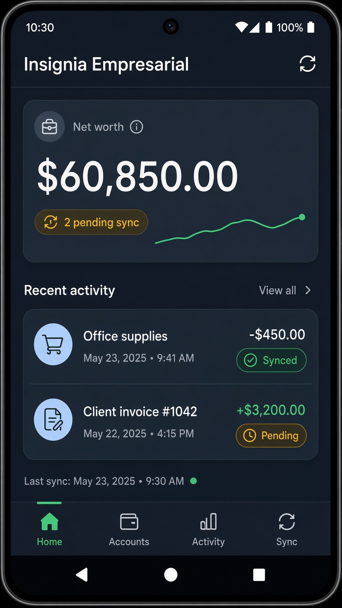
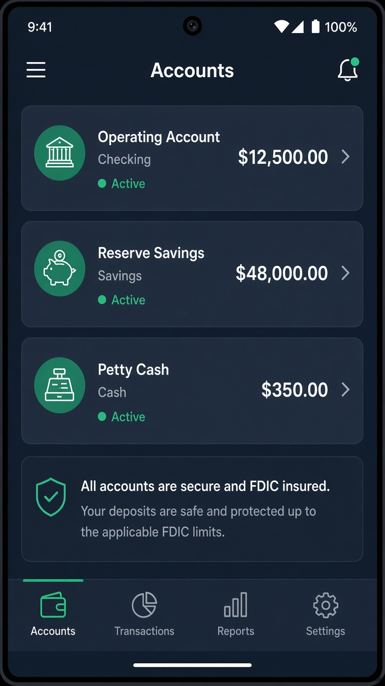
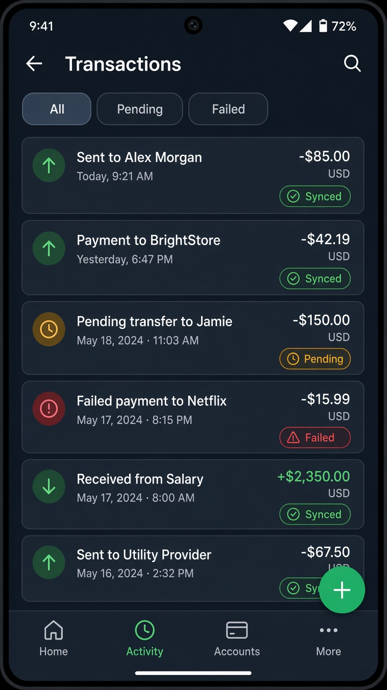
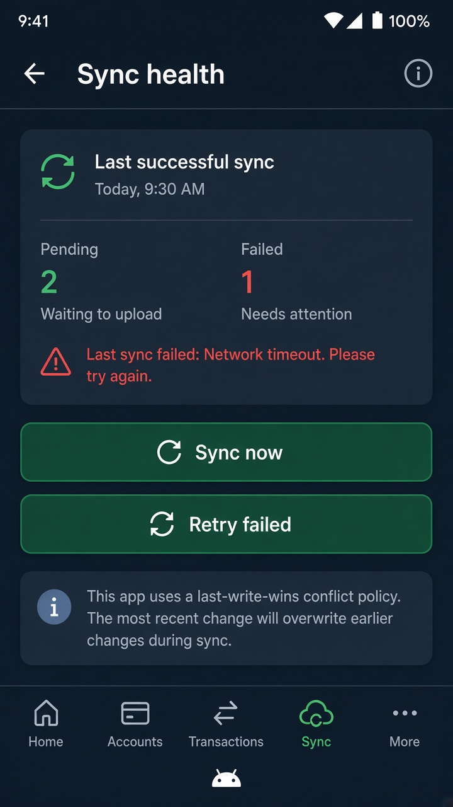

# Insignia Empresarial — Offline-First

Public portfolio app by [DwanZ](https://github.com/DwanZ): a **financial dashboard** built with Clean Architecture, Jetpack Compose, and an offline-first Single Source of Truth.

> Sibling portfolio project: [archMigrationExample](https://github.com/DwanZ/archMigrationExample) (MVP → MVVM → MVI → Compose).

## Demo

| Home | Accounts |
|---|---|
|  |  |

| Transactions | Sync health |
|---|---|
|  |  |

- Fully usable offline (Room as SSOT)
- Local writes enqueue a sync outbox
- WorkManager push/pull with last-write-wins conflicts
- Pending / failed sync status visible in the UI

## Goals

- Modular Clean Architecture (`:core:*`, `:feature:*`)
- Compose UI with MVVM + Unidirectional Data Flow (`StateFlow<UiState>`)
- Room + Retrofit offline-first sync (outbox + WorkManager)
- Brand design system (Emerald / Indigo / Cyan on Slate surfaces)
- Unit tests (MockK) + GitHub Actions on PRs

## Current version

**v0.6.1** — See [CHANGELOG.md](CHANGELOG.md) for the versioned history.

Deep dive: [docs/architecture.md](docs/architecture.md).

## Module map

```
:app
:core:common | domain | database | network | data | sync | designsystem
:feature:home | accounts | transactions | sync
```

## Offline-first sync

1. UI reads **only** from Room (`Flow`).
2. Mutations write Room + `sync_outbox` in one `@Transaction`.
3. WorkManager drains the outbox against a mock Retrofit API.
4. Pull upserts use last-write-wins by `updatedAt`.

To point at a real backend later, keep the Retrofit interfaces and swap `MockInterceptor` / `baseUrl` in `NetworkFactory` — the Room outbox stays the same.

## Stack

| Layer | Tech |
|---|---|
| UI | Jetpack Compose, Material 3, Navigation |
| DI | Hilt |
| Local | Room (SSOT + sync outbox) |
| Remote | Retrofit + OkHttp mock API |
| Sync | WorkManager |
| Tests | MockK, Coroutines Test, Turbine |

## Getting started

```bash
git clone https://github.com/DwanZ/offlinefirstapp.git
cd offlinefirstapp
```

Open in Android Studio, set **Gradle JDK to 17+** (Android Studio JBR), sync Gradle, run the `app` configuration.

```bash
./gradlew :core:domain:test :feature:home:testDebugUnitTest assembleDebug
```

Compose `@Preview` samples live on each feature screen (dark theme) for Studio design tooling.

## License

Apache-2.0 (optional; add LICENSE when publishing releases).
